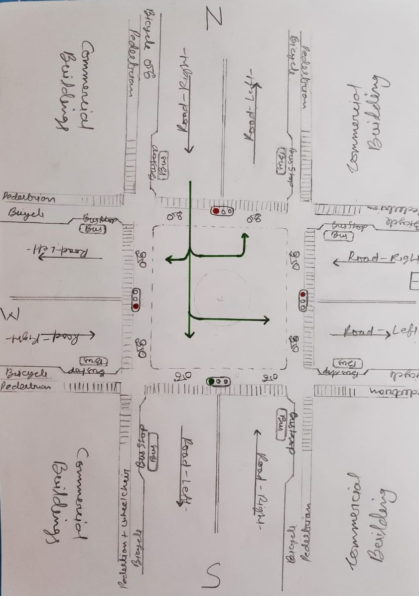

ASSIGNMENT-2
============

### Assignment Design Thinking

### Structure of traffic system
in city we have two roads in different directions such as North and East then these roads interject each other at some point where we have to regulate the traffic. so, every road is divided in to two parts right-part and left-part, right-part of road is always to go ahead in certain direction and left-part is to come back from that certain direction. then on side of every part of road there is a bicycle-passage and then along side of it there is a pedestrian way and strollers-way. we have depicted design in the image below.
How does this system work?

### How traffic will regulate
so traffic move from the four directions North, East, South, West to different direction, so we can assume that traffic from north can go to other rest three direction. so to regulate traffic we divided them into 15second time slots, such as traffic from particular direction will have 15 seconds to pass on, during this time other direction traffic will be stop for certain time. we can understand it in way that suppose at first we let traffic go from the north direction which will have only 15 seconds and this will be indicated by the green light and during this time other direction’s traffic will be stop with different stop time like traffic from East will have 15 second stop time then South traffic will have 30 second stop time then West side traffic will have 45 second stop time with red light signal. so after 45 seconds west signal will have green light for 15 seconds after which all 4 signals light will be red and pedestrian will have 15 seconds to pass through the roads.  
