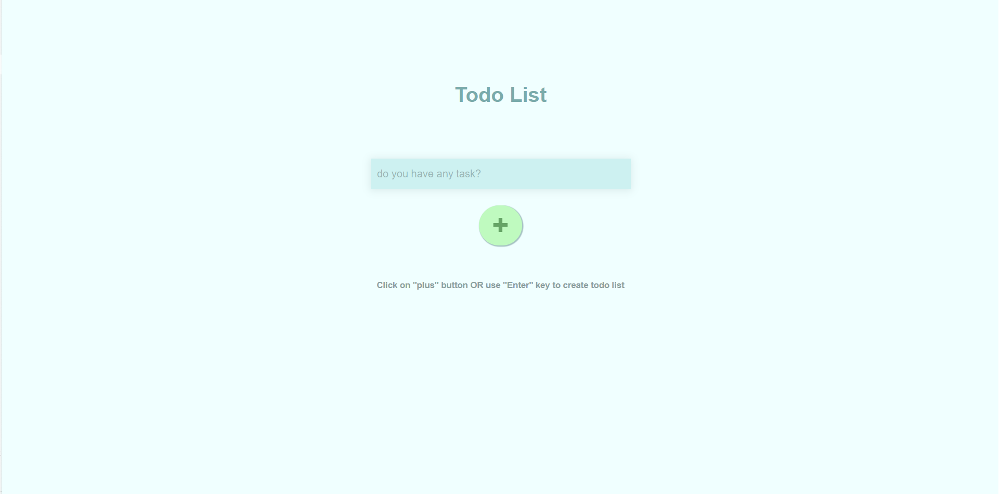
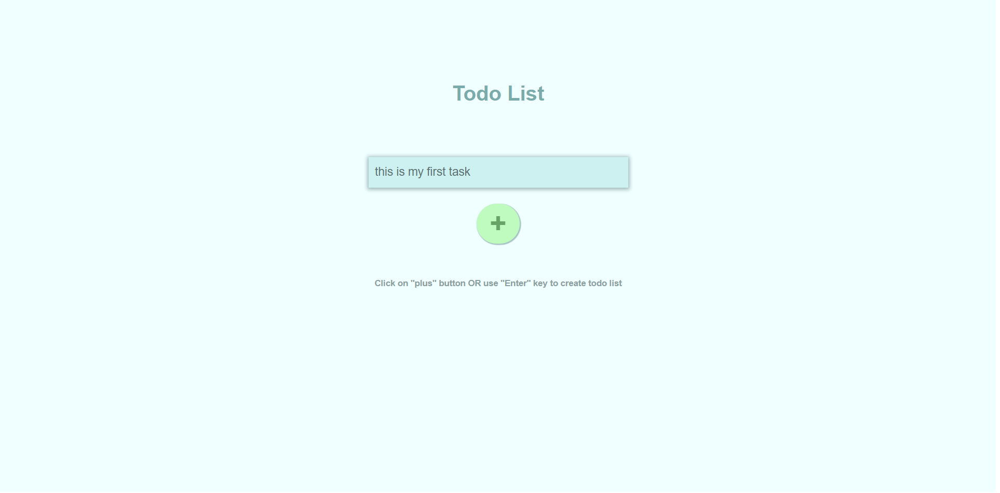
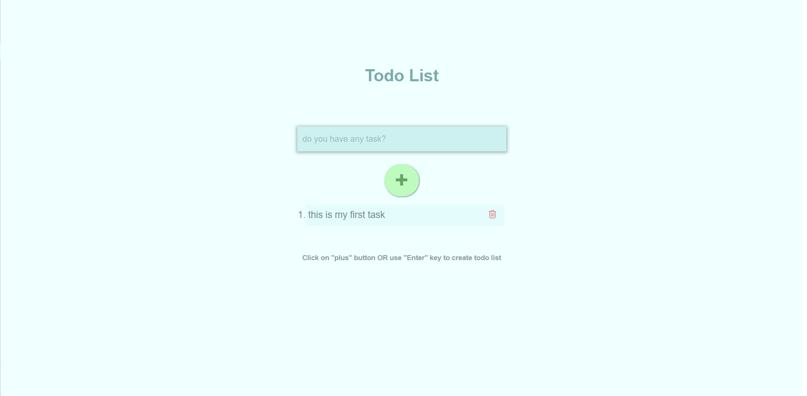
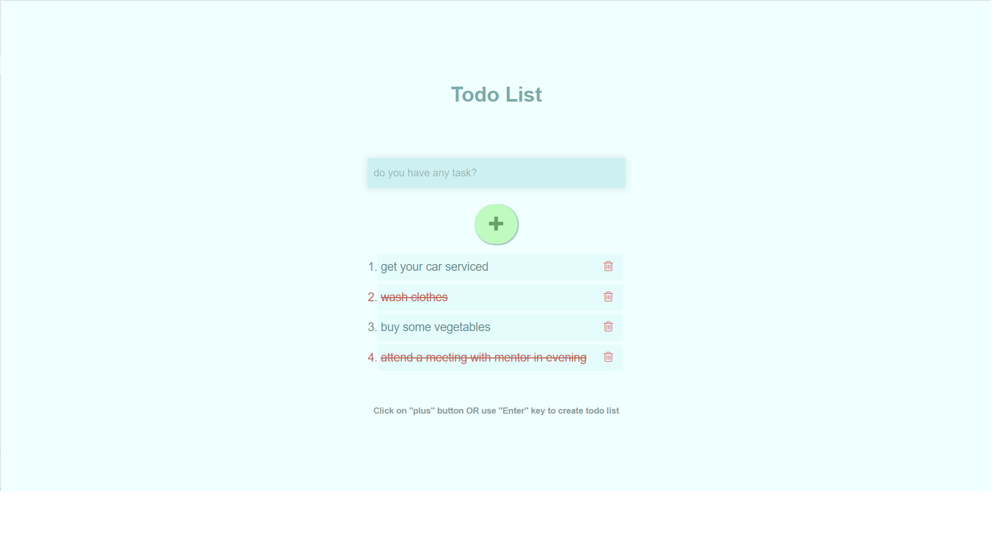
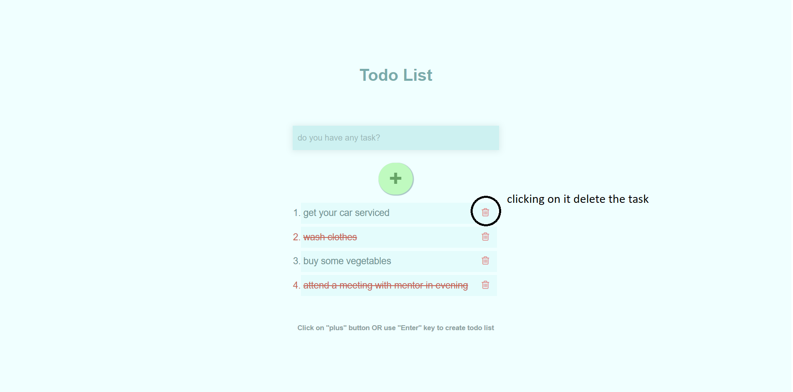

Learn step by step how to use todoapp
=====================================

Note - This app is developed using React liberary so you need to follow
the react path to run this app

-   ### in first step pull the project from the github

-   ### then write command \"npm install\" to install all dependecies of the project

-   ### then goto into folder \"todolistapp\" then write command \"npm start\" to run the project in your browser

-   ### then project will be opned into a browser tab like in the following image
    

-   ### then write your task into the text box like following image
    
    

-   ### then you can press \"Enter\" key or can click on \"plus\" button to create the task like in following image
    
 

-   ### then if you have completed the task, you can mark it complete by clicking on the task like in the following image
    
    

-   ### then you can delete the task by clicking on the \"trash can image\" of the perticular task like in the following image
    
    
